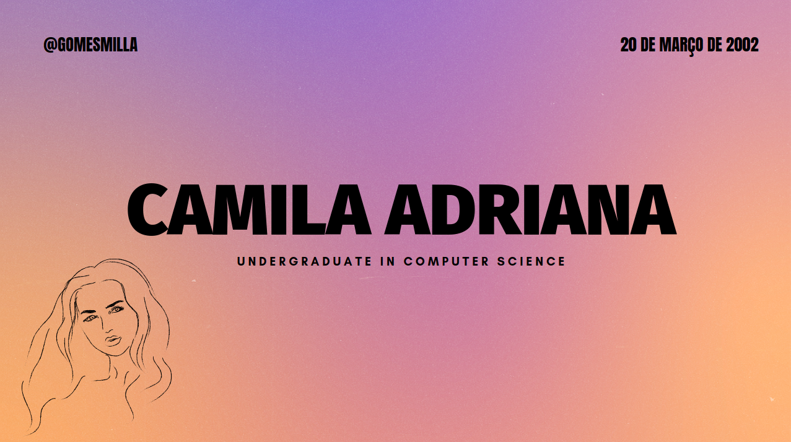

# Hi there! 

My name is ✨ _Camila Adriana Gomes de Jesus_ ✨ and I am a graduate student in Computer Science. I'm Brazilian, I live in Três Corações and currently work at UninCor as a technology assistant. Currently, I program for web technologies like Django, JavaScript. But recently I'm studying mobile devices with React Native

## 👩‍💻 Technologies & Tools

## 👩‍💻 I'm interested

## &#x1f4c8; GitHub Stats

 

## 📱 Contacts

 
 
 

